# Use Azure Cognitive Services and find out what's in your image archive

This repository will cover how to set up a pipeline that will let you test out [Microsoft Cognitive Services](https://azure.microsoft.com/en-gb/services/cognitive-services/) to see what's in your image archive. The code and contents here are intended as a sample and proof-of-concept only.

## Scope

- Place images into Azure Blob storage account
- Azure function triggered by Azure Storage, and reads in images
- Function sends images to Computer Vision API's
  - V1: [Computer Vision API](https://azure.microsoft.com/en-gb/services/cognitive-services/computer-vision/)
  - V2: [Custom Vision Service API](https://azure.microsoft.com/en-gb/services/cognitive-services/custom-vision-service/)
- Azure Function writes response to Azure Storage
- Power BI visualises the data
  - "Find all images of a man with a blue background on grass"

## Technologies

- [Azure Blob Storage](https://azure.microsoft.com/en-gb/services/storage/blobs/)
- [Azure Functions](https://azure.microsoft.com/en-gb/services/functions/)
- [Computer Vision API](https://azure.microsoft.com/en-gb/services/cognitive-services/computer-vision/)
- [Custom Vision Service](https://azure.microsoft.com/en-gb/services/cognitive-services/custom-vision-service/)
- [PowerBI](https://powerbi.microsoft.com/en-us/) - currently Windows only as using Power BI Desktop

## Repository Contents

### Files

- [package.json](package.json)
  - JSON file that is used as part of the deployment of the Azure Functions
- [vision.js](vision.js)
  - Azure Function code that reads from Blob Storage, calls Azure Cognitive Services, and writes results to Azure Storage
- [customVision.js](customVision.js)
  - Azure Function code that reads from Blob Storage, calls Azure Custom Vision API, and writes results to Azure Storage

# Deployment Steps

## Storage Account

- Create a general purpose storage account in the [Azure Portal](https://portal.azure.com/)
  - Add more detailed steps here...
  - Use V1
  - Storage account name 'azureImageProcessing'
- Create container within storage account
  - Click on 'Blobs'
  - Click on '+Container' and create the following containers: vision, customVision, visionResults, customVisionResults
- Get [Azure Storage Explorer](https://azure.microsoft.com/en-us/features/storage-explorer/)
  - Connect Storage Explorer to your Azure account
  - Open the specific storage account you created above

  ## Cognitive Services
  
- Get a [Cognitive Services API Key](https://azure.microsoft.com/en-gb/try/cognitive-services/)
  - In the 'vision.js' set the variable 'visionApiKey' to the API key you get when you register

## Function App

- Create a new Function app using an always-on App service plan
- To confirm Always On... Always On ensure instance execution of the trigger, but is more expensive. For demo and PoC use Always On to see results more quickly.
  - Go to the function
  - Click on 'Platform Features' tab
  - Click on 'Application settings'
  - Confirm that 'Always On' is set to 'On'
- Go to your resource group
- Click on the Function
- Click on the '+' to create a new function
  - Create a 'Blob Trigger' function
  - Set the language to Javascript
  - Give it a name 'visionAnalysis'
  - In 'Azure Blob Storage Trigger' -> 'Path' enter the container name: 'vision', ensure the '/{name}' is after this also, the {name} value is the parameter for a new blob
  - Click on 'Storage account connection' -> 'new', and select the storage account created above named 'azureImageProcessing'
  - Click 'Create'
- Create the output trigger to Azure blog storage
  - On the newly created function click on 'Integrate'
  - For Outputs select 'New Output' and choose 'Azure Blob Storage'
  - Set the 'Path' to 'visionResults/{name}\_{sys.utcNow:yyyy-MM-dd_hh-mm-ss}.csv'
  - Select the Storage account 'azureImageProcessing' from the Storage Account connection dropdown
  - Click on 'Save'
- Copy the code from this github repo to the function file 'index.js' which you can edit in the function
  - The file 'vision.js' is the standard Azure Vision API code
  - Ensure you have changed the value for 'visionApiKey'
- Upload 'package.json' to the site->wwwroot
  - Visit the 'Platofrm Features' tab in the Azure Function
  - Click on 'Advanced tools (Kudu)'
  - Navigate to 'Debug Console'->'CMD'
  - Click on 'site'->'wwwroot'
  - Drag and drop the 'package.json' file to the browser window
  - In the browser window cmd console, execute 'npm install'
- From this point on, uploading an image to the Azure storage container 'vision' will trigger the function, which will call the cognitive services API, and write the results to a CSV file in the Azure Storage container 'visionResults'
- From here you can analyse and view this data however you want. Read on to see how to use PowerBi to start analysiing this data in your Storage account

## PowerBi

- Coming soon...

- Download [PowerBI Desktop](https://powerbi.microsoft.com/en-us/desktop/) and install (Windows only)
- Connect PowerBI to the Azure Storage account above, using the 'visionResults' container
- Create the reports...
  - ...

## Custom Vision Service

In V2 we are able to build a classification model that is built on images you can submit that are specific to your problem.

**One example is:** given a set of images of films (Paddington 2, Wonderwoman, Star Wars: Last jedi ...) can the model predict the correct film given a new image.

## Deployment Steps:
### Create Project
- Visit [https://www.customvision.ai/](https://www.customvision.ai/) and sign in with your Azure credentials

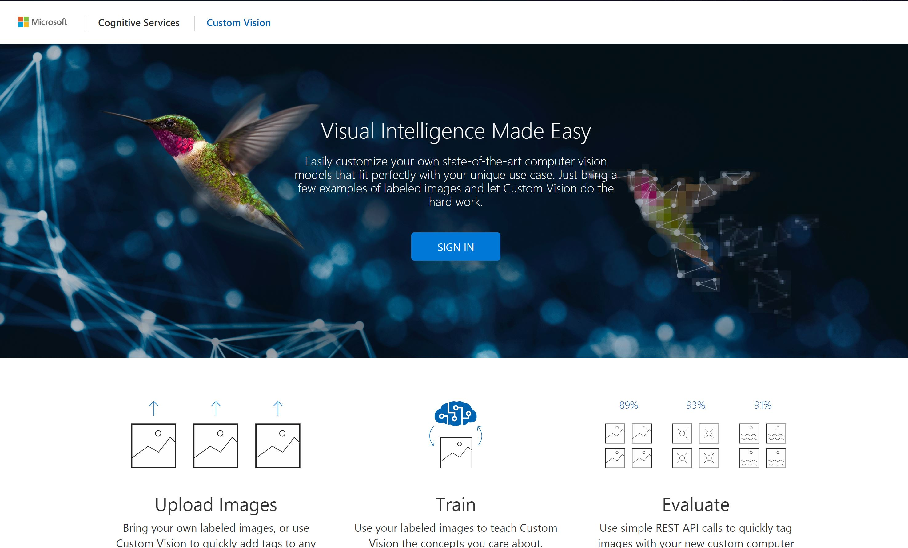

- Create a new project

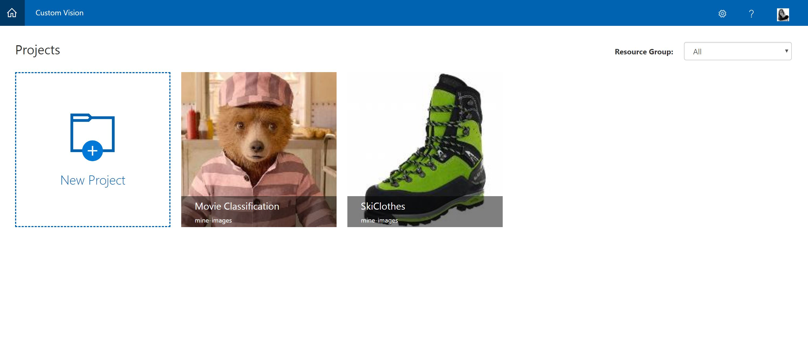

- Set up the question/problem by entering project details:
  - **Name** of project
  - **Description** of what the project does
  - **Domains:** These are pre-trained models that your model will be built off. This is a [form of transfer learning](https://en.wikipedia.org/wiki/Transfer_learning). Choose your base model and build on top. If non of the specific base models suit, choose general.
  - **Resource Group:** In the drop down you should see the previously created Azure Resource group when you created the Azure Storage account and Azure Function
  - Finally click **Create Project**
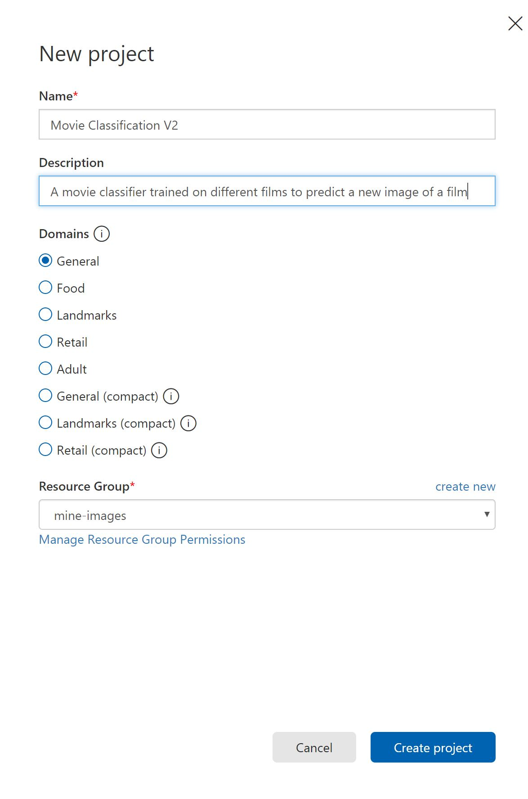

- On the new project dashboard, choose **Add Images**
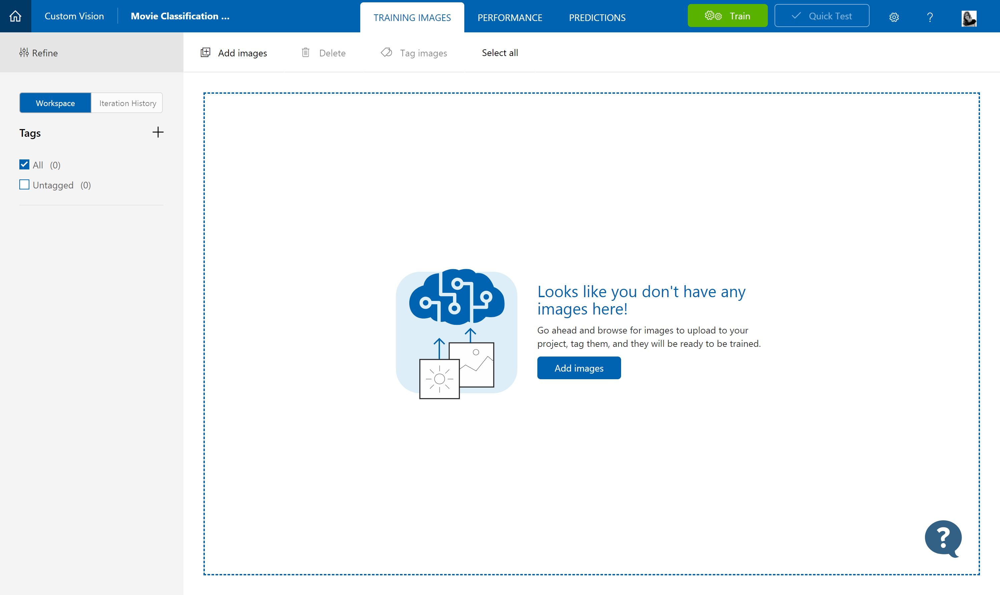
- Upload a set of images that you have as a set - these are called a class. So for example all images of the Paddington 2 film
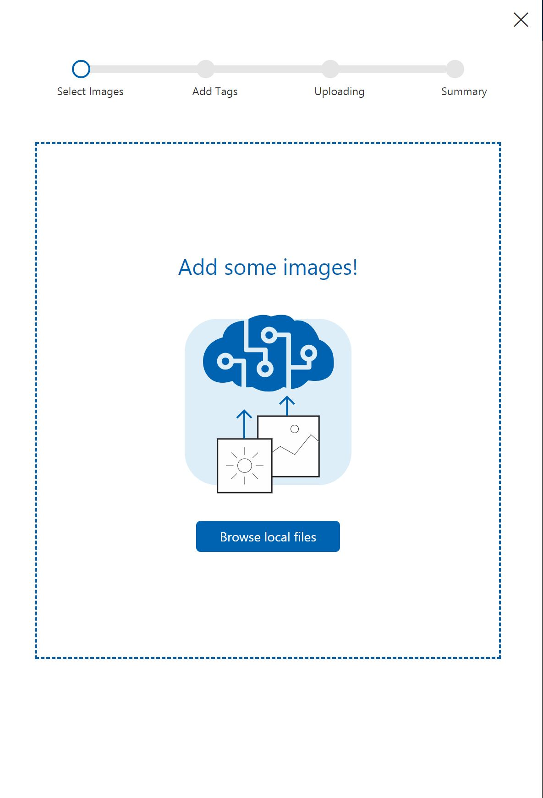
- Add a 'tag' or 'category' to these images
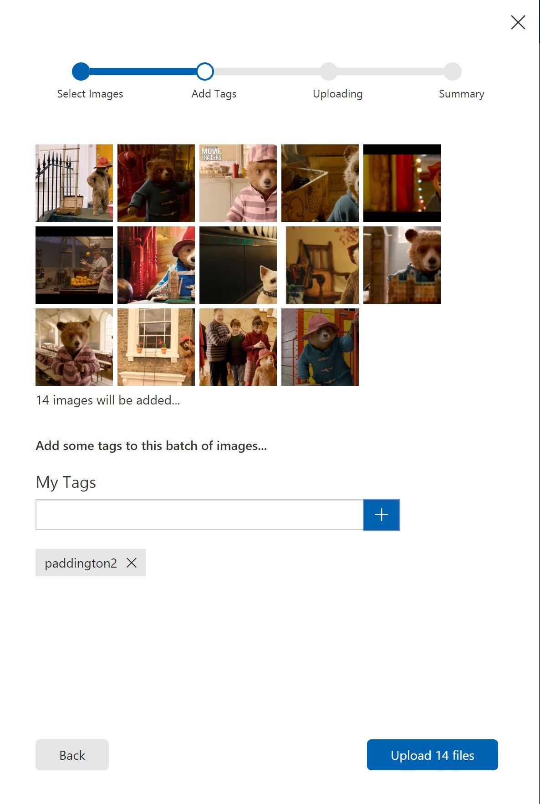
- Upload those files
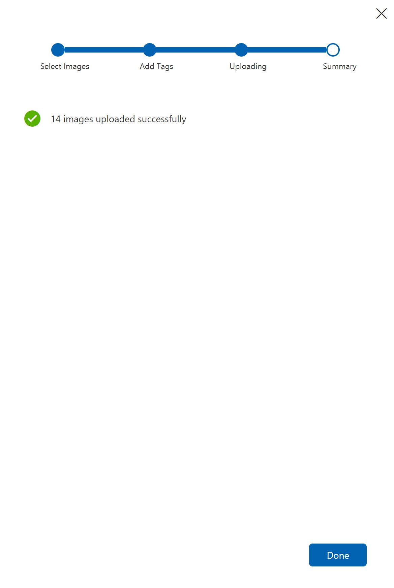
- Now you have added one class for your classification problem, now add more in the same way ...
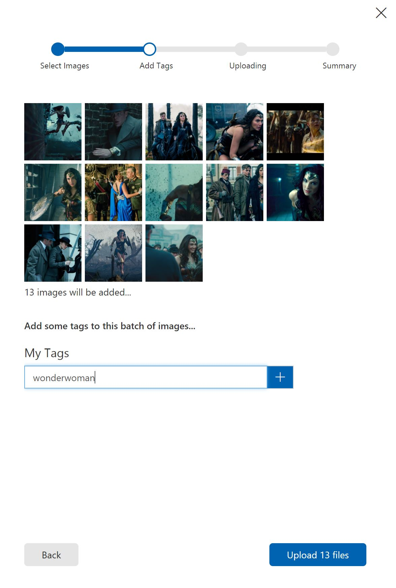
- Once you ahve added all training images and classes, its ready to train the specific model. Choose the **Train** button in the top menu bar
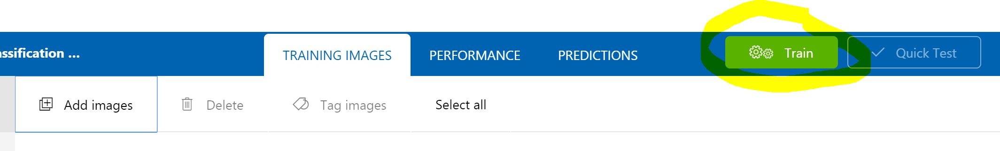
- View the first training results. For only a few images this is good and we will see this improve overtime
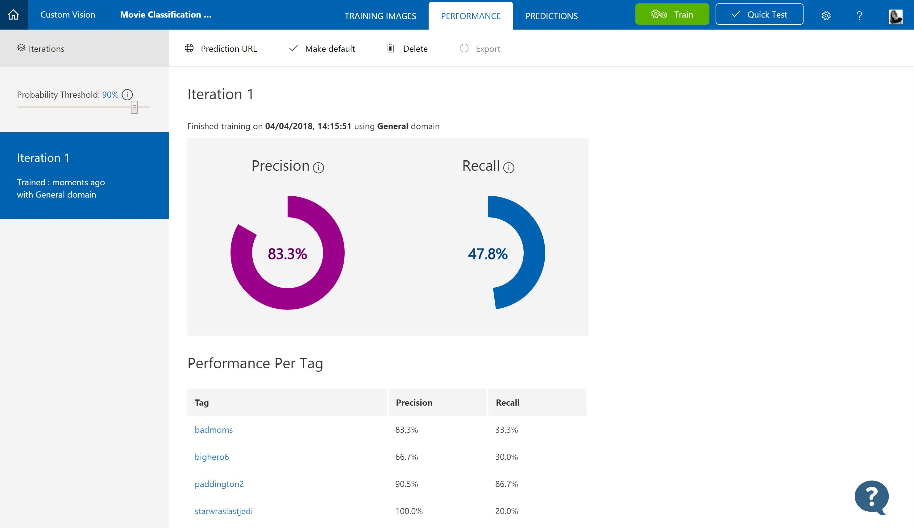

### Test the API
- Lets now test the trained API with a new image. Choose Quick test and upload an image to your API via the UI
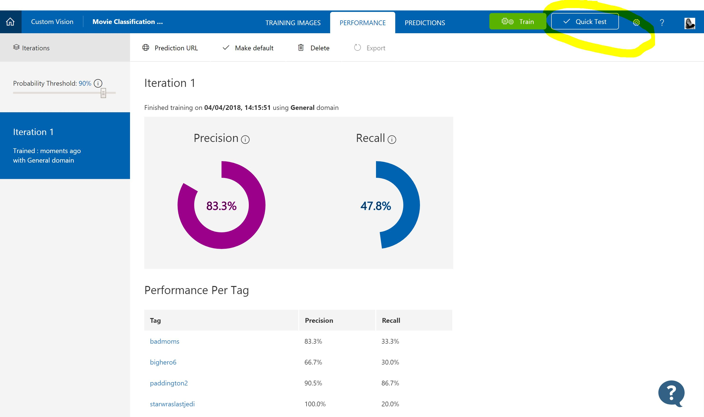
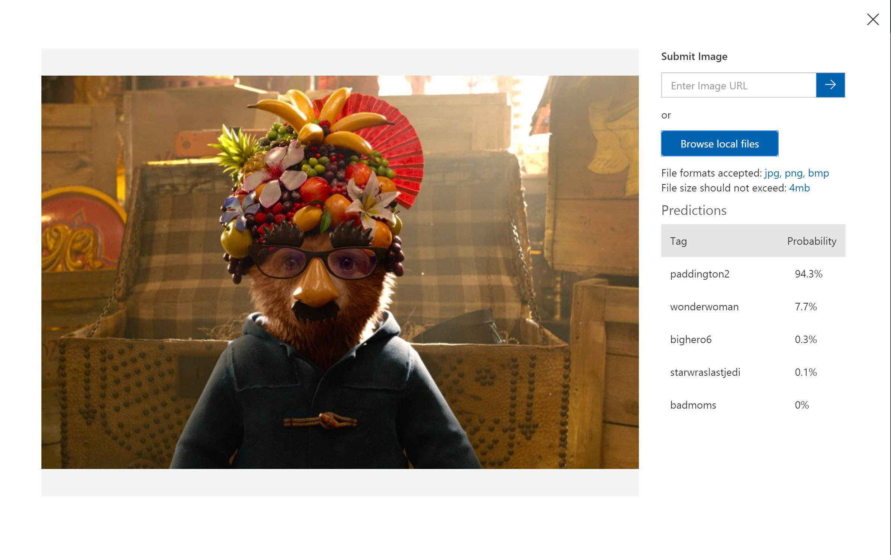

### Retrain the API
- Now you have tested an image you can feed this information back into the model so the model is always improving and updating. In the **Predictions** tab you will now see the images you submitted to your model
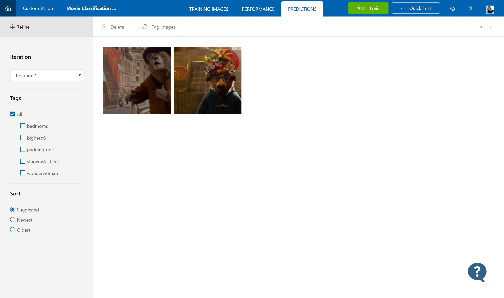
- Select an image and confirm the correct tag for the image
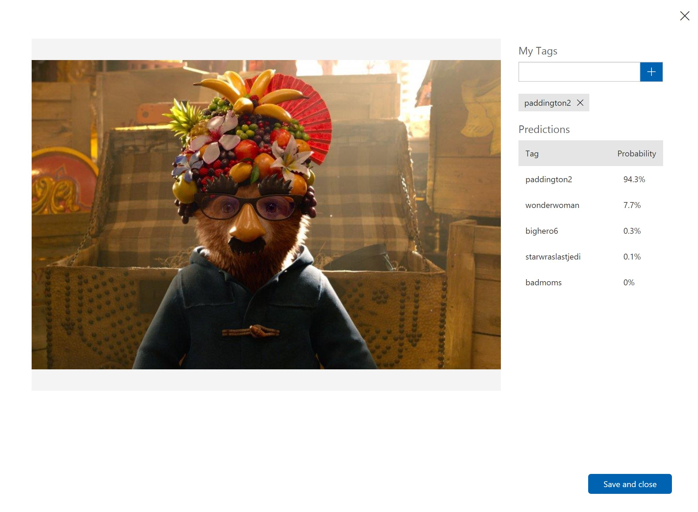
- Now see that image appear in your training images tab
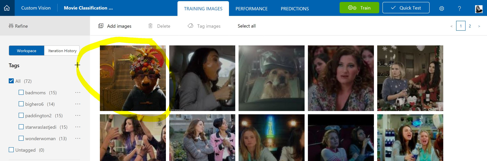
- Choose the train button again and see iteration 2 improve the performance of your model
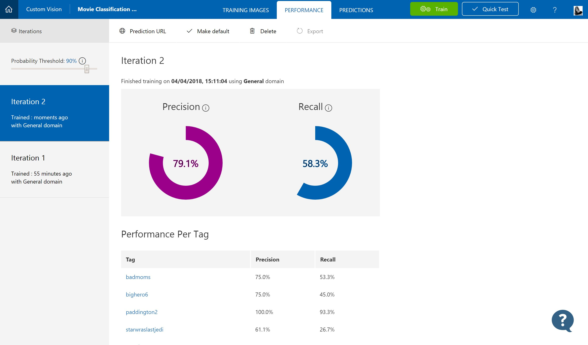

### Call from Azure Function

- Now we need to setup the prediction API so we can 

  - Change answers with test images to train the Machine Learning model
- Copy the Custom Vision Project ID and custom vision API key to 'customVision.js'
- Create a new function in the same function app created above, set up the input triggers and output triggers using the containers 'customVision' and 'customVisionResults' respectively.
- Copy the 'customVision.js' file to the new function, using the same steps as above
- Images copied to 'customVision' container will now show the results in the 'customVisionResults' container
- PowerBI report setup for Custom Vision coming soon....

# TODO

- TODO: Add custom vision deployment steps
- TODO: Add custom vision training steps
- TODO: Add screenshots of the deployment process
- TODO: Add PowerBI set up steps
- TODO: Create [ARM template](https://docs.microsoft.com/en-us/azure/azure-functions/functions-infrastructure-as-code) for complete deployment (will require separate repos)

